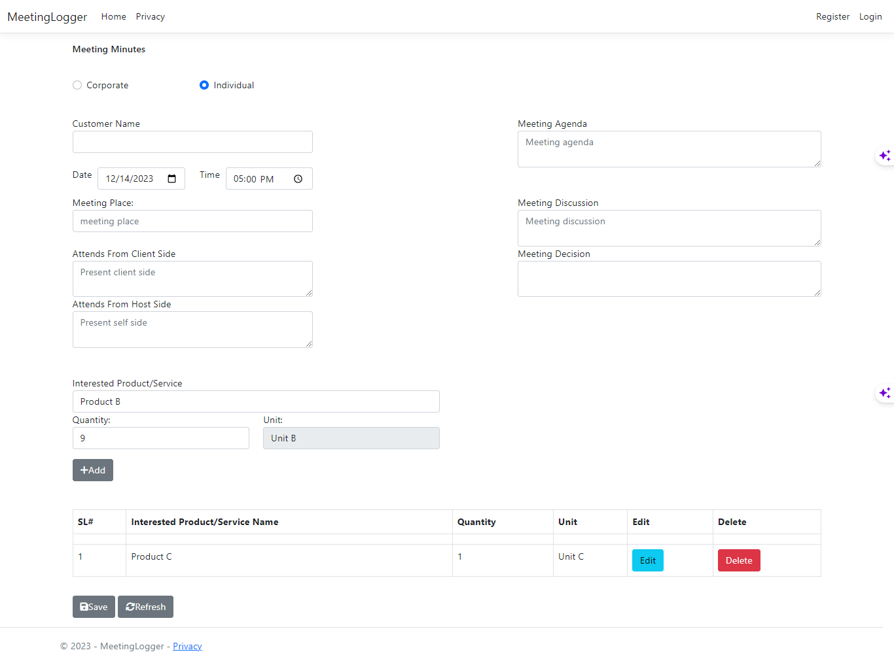

# MeetingLogger




```sql
--MeetingLoggerDB

Use master
CREATE Database MeetingLoggerDB
GO

Use MeetingLoggerDB
GO

CREATE TABLE Corporate_Customer_Tbl (
    Id INT IDENTITY(1,1) PRIMARY KEY,
    CustomerName VARCHAR(100)
);
GO

CREATE TABLE Individual_Customer_Tbl (
    Id INT IDENTITY(1,1) PRIMARY KEY,
    CustomerName VARCHAR(100)
);
GO

CREATE TABLE Products_Service_Tbl (
    Id INT IDENTITY(1,1) PRIMARY KEY,
    ProductName VARCHAR(100),
    Unit VARCHAR(50)
);
GO

CREATE TABLE Meeting_Minutes_Master_Tbl (
    Id INT IDENTITY(1,1) PRIMARY KEY,
    CustomerType VARCHAR(20),
    CustomerName VARCHAR(100),
    MeetingDate DATE,
    MeetingTime TIME
);
GO

USE MeetingLoggerDB;
GO 

-- Alter Meeting_Minutes_Master_Tbl to add new fields
ALTER TABLE Meeting_Minutes_Master_Tbl
ADD MeetingPlace VARCHAR(100),
    AttendsFromClientSide VARCHAR(100),
    AttendsFromHostSide VARCHAR(100),
    MeetingAgenda NVARCHAR(MAX),
    MeetingDiscussion NVARCHAR(MAX),
    MeetingDecision NVARCHAR(MAX);
GO


CREATE TABLE Meeting_Minutes_Details_Tbl (
    Id INT IDENTITY(1,1) PRIMARY KEY,
    MeetingId INT,
    ProductId INT,
    Quantity INT,
    FOREIGN KEY (MeetingId) REFERENCES Meeting_Minutes_Master_Tbl(Id),
    FOREIGN KEY (ProductId) REFERENCES Products_Service_Tbl(Id)
);
GO

CREATE PROCEDURE Meeting_Minutes_Master_Save_SP
    @CustomerType VARCHAR(20),
    @CustomerName VARCHAR(100),
    @MeetingDate DATE,
    @MeetingTime TIME
AS
BEGIN
    INSERT INTO Meeting_Minutes_Master_Tbl (CustomerType, CustomerName, MeetingDate, MeetingTime)
    VALUES (@CustomerType, @CustomerName, @MeetingDate, @MeetingTime)
END;
GO

USE MeetingLoggerDB;
GO

-- Alter the existing stored procedure
ALTER PROCEDURE Meeting_Minutes_Master_Save_SP
    @CustomerType VARCHAR(20),
    @CustomerName VARCHAR(100),
    @MeetingDate DATE,
    @MeetingTime TIME,
    @MeetingPlace VARCHAR(100),
    @AttendsFromClientSide VARCHAR(100),
    @AttendsFromHostSide VARCHAR(100),
    @MeetingAgenda NVARCHAR(MAX),
    @MeetingDiscussion NVARCHAR(MAX),
    @MeetingDecision NVARCHAR(MAX)
AS
BEGIN
    INSERT INTO Meeting_Minutes_Master_Tbl (CustomerType, CustomerName, MeetingDate, MeetingTime, MeetingPlace, AttendsFromClientSide, AttendsFromHostSide, MeetingAgenda, MeetingDiscussion, MeetingDecision)
    VALUES (@CustomerType, @CustomerName, @MeetingDate, @MeetingTime, @MeetingPlace, @AttendsFromClientSide, @AttendsFromHostSide, @MeetingAgenda, @MeetingDiscussion, @MeetingDecision)
END;
GO

CREATE PROCEDURE Meeting_Minutes_Details_Save_SP
    @MeetingId INT,
    @ProductId INT,
    @Quantity INT
AS
BEGIN
    INSERT INTO Meeting_Minutes_Details_Tbl (MeetingId, ProductId, Quantity)
    VALUES (@MeetingId, @ProductId, @Quantity)
END;
GO

-- Sample data insert
USE MeetingLoggerDB;
GO

-- Insert data into Corporate_Customer_Tbl
INSERT INTO Corporate_Customer_Tbl (CustomerName)
VALUES ('ABC Corp'), ('XYZ Inc'), ('LMN Enterprises');
GO

-- Insert data into Individual_Customer_Tbl
INSERT INTO Individual_Customer_Tbl (CustomerName)
VALUES ('John Doe'), ('Jane Smith'), ('Alex Johnson');
GO

-- Insert data into Products_Service_Tbl
INSERT INTO Products_Service_Tbl (ProductName, Unit)
VALUES ('Product A', 'Unit A'), ('Product B', 'Unit B'), ('Product C', 'Unit C');
GO

---- Insert data into Meeting_Minutes_Master_Tbl
--INSERT INTO Meeting_Minutes_Master_Tbl (CustomerType, CustomerName, MeetingDate, MeetingTime)
--VALUES 
--    ('Corporate', 'ABC Corp', '2023-01-15', '09:30:00'),
--    ('Individual', 'John Doe', '2023-01-20', '14:00:00'),
--    ('Corporate', 'LMN Enterprises', '2023-01-25', '11:45:00');
--GO

USE MeetingLoggerDB;
GO

-- Insert additional data into Meeting_Minutes_Master_Tbl
INSERT INTO Meeting_Minutes_Master_Tbl (CustomerType, CustomerName, MeetingDate, MeetingTime, MeetingPlace, AttendsFromClientSide, AttendsFromHostSide, MeetingAgenda, MeetingDiscussion, MeetingDecision)
VALUES 
    ('Corporate', 'ABC Corp', '2023-01-15', '09:30:00', 'Board Room A', 'XYZ Team', 'ABC Corporation', 'Quarterly Review', 'Financial Performance Review', 'Action Items Defined'),
    ('Individual', 'John Doe', '2023-01-20', '14:00:00', 'Meeting Room B', 'John Doe', 'IT Department', 'New Project Proposal', 'Technology Stack Discussion', 'Approved for Initial Development'),
    ('Corporate', 'LMN Enterprises', '2023-01-25', '11:45:00', 'Conference Hall C', 'LMN Management', 'External Consultants', 'Strategic Planning', 'Market Analysis and Strategy', 'Plan for Expansion Finalized');
GO

-- Insert data into Meeting_Minutes_Details_Tbl
INSERT INTO Meeting_Minutes_Details_Tbl (MeetingId, ProductId, Quantity)
VALUES 
    (1, 1, 10),
    (2, 2, 5),
    (3, 3, 8);
GO

---- Save data using store procedure.
--EXEC Meeting_Minutes_Master_Save_SP 'Corporate', 'Example Corp', '2023-03-20', '10:00:00';
--GO

USE MeetingLoggerDB; 
GO

-- Execute the stored procedure with parameter values
EXEC Meeting_Minutes_Master_Save_SP 
    @CustomerType = 'Corporate', 
    @CustomerName = 'Example Corp', 
    @MeetingDate = '2023-03-20', 
    @MeetingTime = '10:00:00',
    @MeetingPlace = 'Conference Room A',
    @AttendsFromClientSide = 'John Doe, Jane Smith',
    @AttendsFromHostSide = 'Host XYZ',
    @MeetingAgenda = 'Discussion on Project ABC',
    @MeetingDiscussion = 'Covered project milestones and challenges',
    @MeetingDecision = 'Resolved to allocate additional resources'
GO

EXEC Meeting_Minutes_Details_Save_SP 4, 2, 15;
GO

-- See data
USE MeetingLoggerDB;
GO

-- Select data from Corporate_Customer_Tbl
SELECT * FROM Corporate_Customer_Tbl;
GO

-- Select data from Individual_Customer_Tbl
SELECT * FROM Individual_Customer_Tbl;
GO

-- Select data from Products_Service_Tbl
SELECT * FROM Products_Service_Tbl;
GO

-- Select data from Meeting_Minutes_Master_Tbl
SELECT * FROM Meeting_Minutes_Master_Tbl;
GO

-- Select data from Meeting_Minutes_Details_Tbl
SELECT * FROM Meeting_Minutes_Details_Tbl;
GO
```

```javascript
        $(document).ready(function () {
            $('input[type=radio][name=customerType]').change(function () {
                var selectedType = $(this).val();
                $('#customerNamesDropdown').empty(); // Clear customer names dropdown

                // Fetch customer names based on selected type via AJAX
                $.ajax({
                    url: '/api/Customer/GetCustomerNames?customerType=' + selectedType,
                    type: 'GET',
                    success: function (data) {
                        $.each(data, function (index, item) {
                            $('#customerNamesDropdown').append($('<option>').text(item).val(item));
                        });
                    },
                    error: function () {
                        $('#customerNameValidation').text('Error fetching customer data');
                    }
                });
            });

            // On page load, fetch all products and populate the dropdown
            $.ajax({
                url: '/api/Product/GetAllProducts',
                type: 'GET',
                success: function (data) {
                    // Populate product dropdown
                    var dropdown = $('#productNamesDropdown');
                    dropdown.empty();
                    dropdown.append('<option value="">select product/service interested</option>');
                    $.each(data, function (index, item) {
                        dropdown.append($('<option></option>').attr('value', item.productName).text(item.productName));
                    });
                },
                error: function () {
                    console.log('Error fetching product data on page load');
                }
            });

            // When a product is selected from the dropdown
            $('#productNamesDropdown').change(function () {
                var selectedProduct = $(this).val();

                // Fetch corresponding product details (like unit) based on selection
                $.ajax({
                    url: '/api/Product/GetProductByName?productName=' + selectedProduct,
                    type: 'GET',
                    success: function (data) {
                        $('#Unit').val(data.unit);
                    },
                    error: function () {
                        console.log('Error fetching product details');
                    }
                });

                // AJAX call to fetch unit details for the selected product
                $.ajax({
                    url: '/api/Product/GetUnitForProduct?productName=' + selectedProduct,
                    type: 'GET',
                    success: function (unit) {
                        // Populate the unit field with fetched data
                        $('#unit').val(unit);
                    },
                    error: function () {
                        console.error('Error fetching unit data');
                    }
                });
            });

            let serialNumber = 1;

            // On Add button click, add product to the table
            $('#addButton').click(function () {

                var productName = $('select#productNamesDropdown').val();
                var quantity = $('input[name="quantity"]').val();
                var unit = $('input[name="unit"]').val();

                // Validate if all fields are filled
                if (productName && quantity && unit) {
                    // Append a new row to the table
                    var newRow = '<tr>' +
                        '<td>' + serialNumber + '</td>' +
                        '<td>' + productName + '</td>' +
                        '<td>' + quantity + '</td>' +
                        '<td>' + unit + '</td>' +
                        '<td><button type="button" class="btn btn-info edit-btn">Edit</button></td>' +
                        '<td><button type="button" class="btn btn-danger delete-btn">Delete</button></td>' +
                        '</tr>';

                    $('#productTable tbody').append(newRow);

                    // Reset input fields after adding
                    $('select#productNamesDropdown').val('');
                    $('input[name="quantity"]').val('');
                    $('input[name="unit"]').val('');

                    // Increment the serial number for the next row
                    serialNumber++;

                } else {
                    // Show an error message or handle validation
                    alert('Please fill in all fields.');
                }
            });

            // Edit functionality
            $('#productTable').on('click', '.edit-btn', function () {
                var row = $(this).closest('tr');
                var productName = row.find('td:eq(1)').text();
                var quantity = row.find('td:eq(2)').text();
                var unit = row.find('td:eq(3)').text();

                // Populate the form fields with row data for editing
                $('select#productNamesDropdown').val(productName);
                $('input[name="quantity"]').val(quantity);
                $('input[name="unit"]').val(unit);

                row.remove();
            });

            // Delete functionality
            $('#productTable').on('click', '.delete-btn', function () {
                $(this).closest('tr').remove();
            });

            // Refresh Button
            $('#refreshButton').click(function () {
                location.reload(); 
            });

            // Save the form
            $('#saveButton').click(function () {
                var formData = $('form').serialize(); // Serialize the form data

                $.ajax({
                    url: '/api/Meeting/SaveMeetingMinutes',
                    type: 'POST',
                    data: formData,
                    success: function (response) {
                        // Handle success response
                        console.log('Meeting data saved:', response);
                    },
                    error: function (error) {
                        // Handle error response
                        console.error('Error saving meeting data:', error);
                    }
                });
            });
        });

```
```csharp
namespace MeetingLogger.Controllers
{
    public class HomeController : Controller
    {
        private readonly ILogger<HomeController> _logger;
        private readonly ApplicationDbContext _context;

        public HomeController(ILogger<HomeController> logger, ApplicationDbContext context)
        {
            _logger = logger;
            _context = context;
        }

        public IActionResult Index()
        {
            return View();
        }

        public IActionResult Privacy()
        {
            return View();
        }

        public async Task<int> MeetingMinutesDetailsSaveSPAsync(int? MeetingId, int? ProductId, int? Quantity, OutputParameter<int> returnValue = null, CancellationToken cancellationToken = default)
        {
            var parameterreturnValue = new SqlParameter("@returnValue", System.Data.SqlDbType.Int)
            {
                Direction = System.Data.ParameterDirection.Output
            };

            var sqlParameters = new[]
            {
                new SqlParameter("@MeetingId", MeetingId ?? (object)DBNull.Value),
                new SqlParameter("@ProductId", ProductId ?? (object)DBNull.Value),
                new SqlParameter("@Quantity", Quantity ?? (object)DBNull.Value),
                parameterreturnValue
            };

            var result = await _context.Database.ExecuteSqlRawAsync("EXEC @returnValue = [dbo].[Meeting_Minutes_Details_Save_SP] @MeetingId, @ProductId, @Quantity", sqlParameters, cancellationToken);

            returnValue?.SetValue(parameterreturnValue.Value);

            return result;
        }

        public async Task<int> MeetingMinutesMasterSaveSPAsync(string CustomerType, string CustomerName, DateOnly? MeetingDate, TimeOnly? MeetingTime, string MeetingPlace, string AttendsFromClientSide, string AttendsFromHostSide, string MeetingAgenda, string MeetingDiscussion, string MeetingDecision, OutputParameter<int> returnValue = null, CancellationToken cancellationToken = default)
        {
            var parameterreturnValue = new SqlParameter("@returnValue", System.Data.SqlDbType.Int)
            {
                Direction = System.Data.ParameterDirection.Output
            };

            var sqlParameters = new[]
            {
                new SqlParameter("@CustomerType", CustomerType ?? (object)DBNull.Value),
                new SqlParameter("@CustomerName", CustomerName ?? (object)DBNull.Value),
                new SqlParameter("@MeetingDate", MeetingDate ?? (object)DBNull.Value),
                new SqlParameter("@MeetingTime", MeetingTime ?? (object)DBNull.Value),
                new SqlParameter("@MeetingPlace", MeetingPlace ?? (object)DBNull.Value),
                new SqlParameter("@AttendsFromClientSide", AttendsFromClientSide ?? (object)DBNull.Value),
                new SqlParameter("@AttendsFromHostSide", AttendsFromHostSide ?? (object)DBNull.Value),
                new SqlParameter("@MeetingAgenda", MeetingAgenda ?? (object)DBNull.Value),
                new SqlParameter("@MeetingDiscussion", MeetingDiscussion ?? (object)DBNull.Value),
                new SqlParameter("@MeetingDecision", MeetingDecision ?? (object)DBNull.Value),
                parameterreturnValue
            };

            var result = await _context.Database.ExecuteSqlRawAsync("EXEC @returnValue = [dbo].[Meeting_Minutes_Master_Save_SP] @CustomerType, @CustomerName, @MeetingDate, @MeetingTime, @MeetingPlace, @AttendsFromClientSide, @AttendsFromHostSide, @MeetingAgenda, @MeetingDiscussion, @MeetingDecision", sqlParameters, cancellationToken);

            returnValue?.SetValue(parameterreturnValue.Value);

            return result;
        }


        [ResponseCache(Duration = 0, Location = ResponseCacheLocation.None, NoStore = true)]
        public IActionResult Error()
        {
            return View(new ErrorViewModel { RequestId = Activity.Current?.Id ?? HttpContext.TraceIdentifier });
        }
    }
}
```

```html
<div class="container">
    <h6>Meeting Minutes</h6>
    <form asp-controller="Meeting" asp-action="SaveMeetingMinutes" method="post">
        <div class="form-group" style="margin: 40px 0;">
            @* <label>Customer Type:</label> *@
            <div class="row">
                <div class="col-md-2">
                    <div class="form-check">
                        <input class="form-check-input" type="radio" id="radioCorporate" name="customerType" value="Corporate">
                        <label class="form-check-label" for="radioCorporate">Corporate</label>
                    </div>
                </div>
                <div class="col-md-2">
                    <div class="form-check">
                        <input class="form-check-input" type="radio" id="radioIndividual" name="customerType" value="Individual">
                        <label class="form-check-label" for="radioIndividual">Individual</label>
                    </div>
                </div>
            </div>
        </div>

        <div class="row">
            <div class="col-md-4">
                <label>Customer Name</label>
                <select class="form-control" id="customerNamesDropdown">
                    <option value="">select customer name</option>
                </select>
                <span class="text-danger" id="customerNameValidation"></span>
            </div>
            <div class="col-md-3"></div>
            <div class="col-md-5">
                <label>Meeting Agenda</label>
                <textarea asp-for="MeetingAgenda" class="form-control" placeholder="Meeting agenda  "></textarea>
                <span asp-validation-for="MeetingAgenda" class="text-danger"></span>
            </div>
        </div>

        <div class="row">
            <div class="col-md-2" style="display:flex; margin-bottom: 10px;">
                <label style="margin-right: 10px;">Date</label>
                <input asp-for="MeetingDate" class="form-control" type="date" />
                <span asp-validation-for="MeetingDate" class="text-danger"></span>
            </div>
            <div class="col-md-2" style="display:flex; margin-bottom: 10px;">
                <label style="margin-right: 10px;">Time</label>
                <input asp-for="MeetingTime" class="form-control" type="time" />
                <span asp-validation-for="MeetingTime" class="text-danger"></span>
            </div>
        </div>


        <div class="row">
            <div class="col-md-4">
                <label>Meeting Place:</label>
                <input asp-for="MeetingPlace" class="form-control" placeholder="meeting place" />
                <span asp-validation-for="MeetingPlace" class="text-danger"></span>
            </div>
            <div class="col-md-3"></div>
            <div class="col-md-5">
                <label>Meeting Discussion</label>
                <textarea asp-for="MeetingDiscussion" class="form-control" placeholder="Meeting discussion"></textarea>
                <span asp-validation-for="MeetingDiscussion" class="text-danger"></span>
            </div>
        </div>

        <div class="row">
            <div class="col-md-4">
                <label>Attends From Client Side</label>
                <textarea asp-for="AttendsFromClientSide" class="form-control" placeholder="Present client side "></textarea>
                <span asp-validation-for="AttendsFromClientSide" class="text-danger"></span>
            </div>
            <div class="col-md-3"></div>
            <div class="col-md-5">
                <label>Meeting Decision</label>
                <textarea asp-for="MeetingDecision" class="form-control"></textarea>
                <span asp-validation-for="MeetingDecision" class="text-danger" placeholder="Meeting decision"></span>
            </div>
        </div>

        <div class="row">
            <div class="col-md-4">
                <label>Attends From Host Side</label>
                <textarea asp-for="AttendsFromHostSide" class="form-control" placeholder="Present self side"></textarea>
                <span asp-validation-for="AttendsFromHostSide" class="text-danger"></span>
            </div>
        </div>

        <!--Products-->
        <br/><br/>

        <div class="row">
            <div class="col-md-6">
                <label>Interested Product/Service</label>
                <select asp-for="ProductName" class="form-control" id="productNamesDropdown">
                    <option value="">select product/service interested</option>
                </select>
                <span asp-validation-for="ProductName" class="text-danger"></span>
            </div>
        </div>

        <div>
            <div class="row">
                <div class="col-md-3">
                    <label>Quantity:</label>
                    <input asp-for="Quantity" class="form-control" id="quantity" name="quantity" />
                    <span asp-validation-for="Quantity" class="text-danger"></span>
                </div>
                <div class="col-md-3">
                    <label>Unit:</label>
                    <input asp-for="Unit" class="form-control" id="unit" name="unit"  readonly />
                    <span asp-validation-for="Unit" class="text-danger"></span>
                </div>
            </div>

            <button type="button" id="addButton" class="btn btn-secondary mt-3"><span class="mr-2"><i class="fa-solid fa-plus"></i></span>Add</button>
        </div>


        <!-- Bootstrap Table -->
        <div class="mt-5">
            @* <h2>Product Details</h2> *@
            <table class="table table-bordered" id="productTable">
                <thead>
                    <tr>
                        <th>SL#</th>
                        <th scope="col">Interested Product/Service Name</th>
                        <th scope="col">Quantity</th>
                        <th scope="col">Unit</th>
                        <th scope="col">Edit</th>
                        <th scope="col">Delete</th>
                    </tr>
                </thead>
                <tbody>
                    <!-- Rows to be dynamically added -->
                    <tr>
                        <td></td>
                        <td><!-- Input field for Interested Product/Service --></td>
                        <td><!-- Input field for Quantity --></td>
                        <td><!-- Input field for Unit --></td>
                        <td><!-- Buttons for actions (e.g., Edit/Delete) --></td>
                        <td></td>
                    </tr>
                    <!-- Additional rows will be added dynamically -->
                </tbody>
            </table>
        </div>

        <button id="saveButton" type="button" class="btn btn-secondary mt-3">
            <span class="mr-2"><i class="fas fa-save"></i></span>Save
        </button>

        <button id="refreshButton" type="button" class="btn btn-secondary mt-3">
            <span class="mr-2"><i class="fa fa-refresh" aria-hidden="true"></i></span>Refresh
        </button>

    </form>
</div>
```
